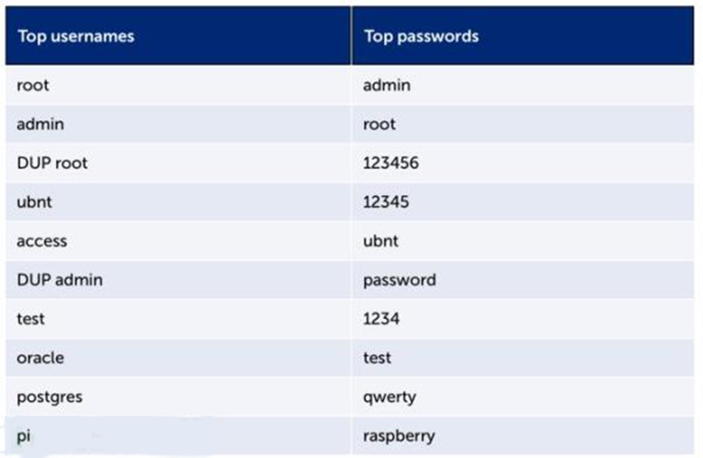

#  Crunch命令生成字典

暴力破解的成功与否、效率高低，关键是看”口令字典“是否给力。下面是常用的用户名和弱密码

### crunch（没有办法的办法）

##### 用来给定一个字符集生成一个全集的字典

crunch <min-len> <max-len> [<charset string>] [options] 

min-len:生成口令的最小长度

max-len:生成口令的最大长度

charset string : 生成口令的字符集

比如abc这3个字符能够组成的2位密码有9个:aa ab ac ba bb bc ca cb cc

##### 将生成的密码存到wordlist.txt中

crunch 2 2 abc -o wordlist.txt

crunch 2 2 abc > wordlist.txt

##### 穷举法 银行卡密码

crunch 6 6 0123456789 -o wordlist.txt

##### 使用特定的字符集文件

crunch 2 2 -f /usr/share/crunch/charset.lst numeric

打开charset.lst文件发现这是一个字符集 numeric是一种字符集

##### 缺点

crunch 6 16 -f /usr/share/crunch/charset.lst mixalpha-numeric-symbol14-sv 

使用该字符集

生成的字典的大小有100PB左右 将这个字符集对ssh进行暴力破解的话 需要很高的时间成本

