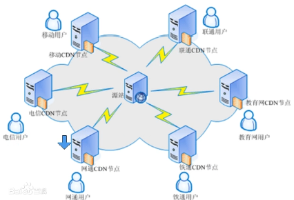

## 域名

#### 什么是域名？

网站的名字 www.baidu.com

#### 域名在哪里注册?

国内最大的域名注册--阿里云

#### 什么二级域名、多级域名?

www 顶级域名

baidu.com

news.baidu.com //news二级域名

shehui.news.baidu.com//shehui 三级域名 

#### 为什么要收集域名？

渗透目标 大多数是对主站进行安全检测

但当主站渗透不进去的时候 就可以尝试渗透它的二级域名（子网页）如果有漏洞就可以渗透而获得一定权限

#### DNS域名系统(服务)协议

用于域名和IP地址的相互转换

电脑设置：
自动获取DNS服务器地址（向上进行解析，连接路由器就将按照路由器的域名进行解析）

使用下面的DNS服务器

114.114.114.114

114.114.115.115

#### TTL

生效的时间 需要一定的时间向全网公告 该解析地址 将通知DNS进行域名解析

#### 本地host

重定向解析IP地址

ping 网站的时候 先到host中有没有这个域名 就会以host文件为准

#### host应用

###### 1、如果能够修改对方的host地址 绑定到自己的服务器生成的IP地址上,在前端做一个一摸一样的界面(钓鱼攻击)

###### 2、加速器原理

###### 修改本机host文件

###### 原本steam的域名在国外 那肯定没有国内 访问 国内快，此时加速器修改host域名 将他定向到国内 就可以进行 国内对国内的访问。

#### CND（内容分布网络）节点技术

我们访问网站都是访问节点 源主站离你的位置很远 例如国外访问国内 国内访问国外 速度会很慢 为了解决速度问题 可以访问距离你最近的一个节点 来实现加速

可以把节点想象成一个缓存 那么对这个网站进行扫描 扫描的就是网站的缓存 真实数据等会保存在源站 对于安全检测没有意义 会有一定干扰

#### 与DNS的关系

在更改DNS的解析服务器的地址的话 解析的IP地址相同因为 改变DNS 只影响解析的速度

CDN会根据地区来选择就近的节点

#### 常见的DNS安全攻击

DNS服务器 大量IP被恶意解析 将访问地址被恶意指向恶意指向（被黑）看到的界面与原本不同 这种被黑只针对地区 因为不同地区 DNS服务解析不同  如果只单纯只黑一个DNS服务器 就只会影响一个地区的服务器在在访问该站点的时候被恶意解析 恶意指向

#### 脚本语言

1、常见的脚本语言类型

ASP **PHP** ASPX JSP **JAVAWeb** **Python** CGI

2、不同脚本类型与安全漏洞的关系

源码不同 会影响漏洞挖掘的难易程度

3、漏洞挖掘代码审计与脚本类型的关系

程序源代码的选用 写法 将决定一个程序的漏洞挖掘的难易程度

PHP小众网站开发

JAVA大众网站开发

安全性不同

#### 后门

1、什么是后门

攻击者得到相关的权限了以后呢 留下一个后门文件 便于下次操作

后门是各种各样的 

2、后门在安全测试中的实际意义

（1）方便下次进来（操作）

（2）如获取相关权限的时候 类似一个管道 去操作服务器、

3、后门玩法和免杀

（1）玩法

网站后门去控制网站

隐藏在某个地方

玩法各样 与目的相关

（2）免杀

防止被病毒检测工具识别到

#### WEB 

1、组成架构模型

网站源码(PHP JAVA PYTHON) 分脚本类型 分应用方向(由于使用方向性的问题 代码函数等使用也不同 例如 网站不需要上传 就不会产生上传漏洞)

操作系统 Windows Linux（决定攻击方向） 

中间件（搭建平台）apache iis tomacat nginx等 （提供服务）

数据库 access mysql mssql oracle sybass db2 postsq等（存储）

2、为什么要从WEB层面为主为首呢？

因为WEB使用面广 WEB上面漏洞比较多

操作系统的危害很小 没有什么作用 

要么很大 但是可以打补丁

但网站攻击没有 没有打补丁一说

#### WEB相关安全漏洞

###### 漏洞的执行有一定的先决条件

1、WEB源码类对应漏洞

SQL注入 上传 XSS 代码执行 变量覆盖 逻辑漏洞  反序列化等

2、WEB中间件对应漏洞

3、其他第三方对应漏洞

4、APP或PC应用结合类

功能越多 相应漏洞发现的几率也会越高 出现问题的概率也会大大下降

APP和PC客户端会和网站有关联 分析客户端进行安全检测

软件逆向破解 破解协议和代码

网站可以和APP套用

